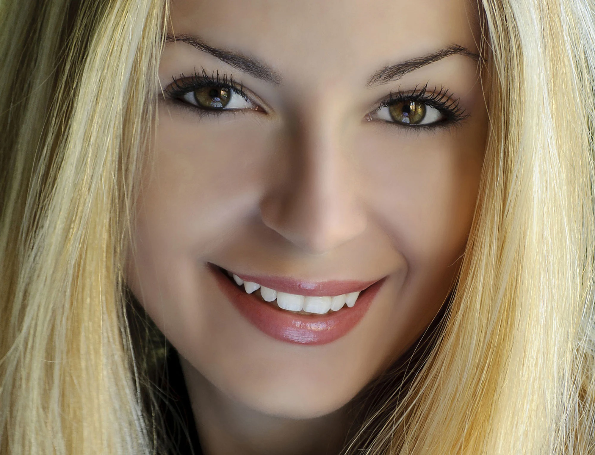

# Happy-Sad-Face-Classifier

A simple deep learning project that classifies faces as **happy** or **sad** using a fine-tuned `ResNet18` model, trained on images scraped from the web using `duckduckgo_search`.

---

## Example Prediction

<table align="center">
  <tr>
    <td align="center"></td>
    <td align="center"></td>
  </tr>
  <tr>
    <td align="center"><b>happyface.jpg</b></td>
    <td align="center"><b>sadface.jpg</b></td>
  </tr>
</table>

```python
is_happy, _, probs = learn.predict(PILImage.create('happyface.jpg'))
# Output: happy face
# Probability it's a happy face: 0.9968
```

```python
is_happy, _, probs = learn.predict(PILImage.create('sadface.jpg'))
# Output: sad face
# Probability it's a happy face: 0.0000
```
